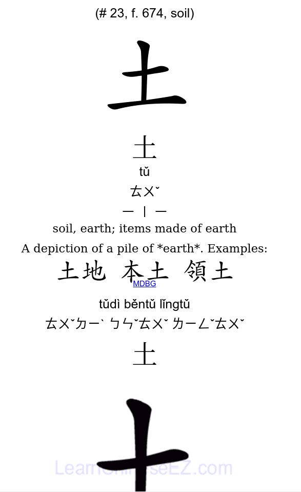
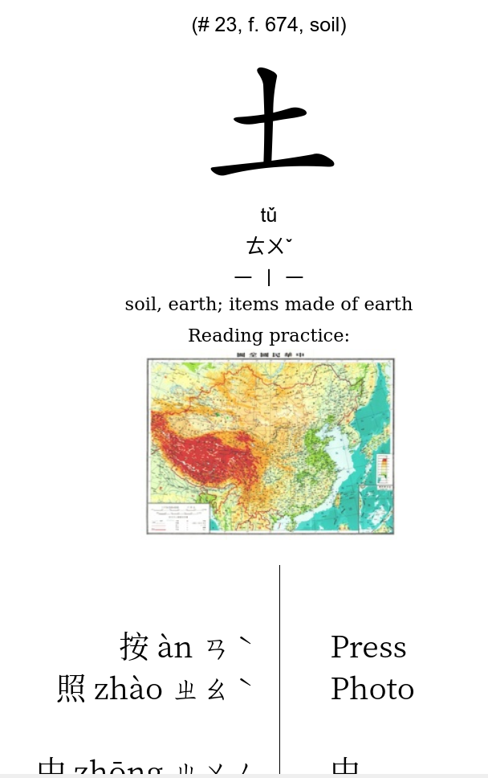
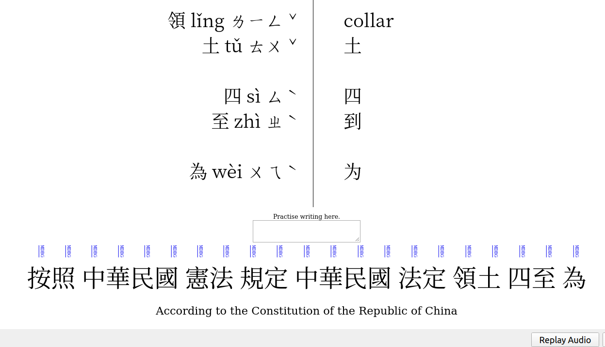

# hanzi_3000_anki
Anki deck with 3182 traditional characters, annotated with examples, sounds, images.

This project was a spin-off from multiple projects and involved a lot of text processing and curation. It depends on the following works:

chinese-char-animations: for gif files, simplified characters only, https://github.com/nmarley/chinese-char-animations
mp3-chinese-pinyin-sound: for pinyin sounds for all characters, https://github.com/davinfifield/mp3-chinese-pinyin-sound/tree/master/mp3
mcp dataset for 1 image each character (can't find the link :( )

The characters and mnemonics are based on Remembering Traditional Hanzi, books 1 and 2, and is a ripoff from an earlier Hanzi 3000 deck (https://github.com/agj/3000-traditional-hanzi).

Scripts and raw data available in the repository minus the above mentioned 3 resources.

Steps:

Examples were annotated with Zhuyin, Pinyin and Images. The column was fuzzy matched with exsisting examples into a new column called Additional Examples.

Each entry was then tokenised and zhuyin, pinyin were combined together.

Each character was annotated for MDBG online dictionary lookup.

The examples were formatted and converted into a document and translated into google translate. Then imported back to the deck.

All information was combined into Anki Deck, and html processed.

How to use:

Install Ankidroid on android or Ankidesktop (https://ankiweb.net/about)

Load collections-hanzi package (https://disk.yandex.com/d/fQwss6UHf0nTvA)
  ^
  |
  this link contains all the media files required for the deck + the deck

Enjoy! :))

